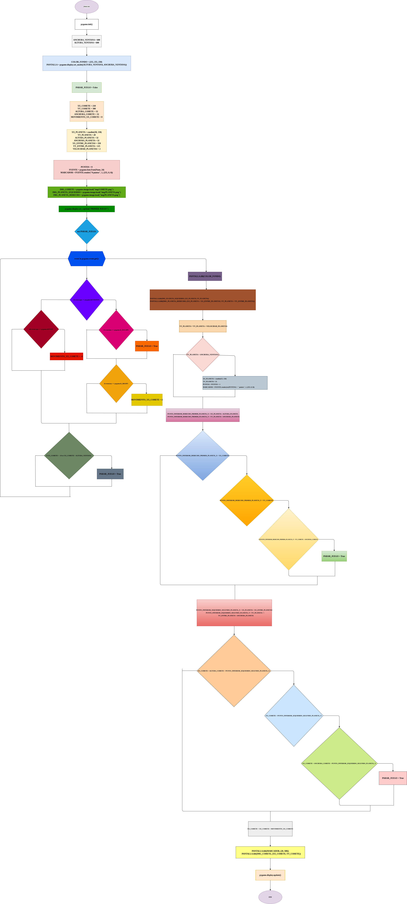

# Bimestral N. 1

Este es un juego simple desarrollado con Python y Pygame, en el que el jugador o usuario controla un cohete que debe esquivar planetas mientras suma puntos.

# Processing
- ```import pygame```: nos sirve para importar la función que va a permitir que corra el juego.

- ```from random import randint```: va a permitir importar la función para digitar números aleatorios.

- ```pygame.init()```: palabra para definir el método constructor de la clase. Es lo primero que se ejecuta cuando creas un objeto de una clase.

- ```ANCHURA_VENTANA = 600, ALTURA_VENTANA = 600```: le indicamos al programa de que tamaño debe abrir la ventana en la que se ejecutará el juego.

- ```COLOR_FONDO = (255, 255, 250), PANTALLA = pygame.display.set_mod((ALTURA_VENTANA, ANCHURA_VENTANA))```: le indicamos con el sistema RGB los colores y se inicializa una ventana o pantalla para su visualización.

- ```PARAR_JUEGO = False```: buleano de gestión del bucle.

- ```XX_COHETE = 210, YY_COHETE = 300, ALTURA_COHETE = 32, ANCHURA_COHETE = 32, MOVIMIENTO_XX_COHETE = 0```: le indicamos como son las características del objeto cohete.

- ```XX_PLANETA = randint(30, 130), YY_PLANETA = 20, ALTURA_PLANETA = 32, ANCHURA_PLANETA = 32,XX_ENTRE_PLANETAS = 350, YY_ENTRE_PLANETA = 125, VELOCIDAD_PLANETAS = 2```: características de los planetas.

- ```PUNTOS = 0, FUENTE = pygame.font.Font(None, 24), MARCADOR = FUENTE.render("0 puntos", 1, (255, 0, 0))```: indicamos que los puntos empiezan en 0, y van subiendo a medida que los planetas pasen y no choquen con el cohete. Indicamos el color y la fuente de la palabra "PUNTOS" y su contador.

- ```IMG_COHETE = pygame.image.load("img/COHETE.png"), IMG_PLANETA_IZQUIERDO = pygame.image.load("img/PLANETA.png"), IMG_PLANETA_DERECHO = pygame.image.load("img/PLANETA.png")```: exportamos las imágenes del cohete y el planeta. 

- ```pygame.display.set_caption("PRIMER JUEGO")```: establece el título de la ventana que contiene la superficie de visualización.

- ```while not PARAR_JUEGO```: creamos un bucle para el resto del programa. "Mientras no PARAR_JUEGO": significa que mientras que no se detenga el juego se va a hacer lo que se indique dentro del bucle:

- ```for event in pygame.event.get():```: función para que por cada evento en el juego pase lo siguiente:

- ```if event.type == pygame.KEYDOWN:, if event.key == pygame.K_ESCAPE:, PARAR_JUEGO = True, if event.key == pygame.K_RIGHT:, MOVIMIENTO_XX_COHETE = 4```: condición para que si lo que está pasando es igual a un evento que se activa cuando se presiona una tecla, y si ese evento es igual a la tecla ESC, se afirma que se debe detener el juego. Si la tecla que se presiona es RIGHT, se mueve 4.

- ```elif event.type == pygame.KEYUP:, MOVIMIENTO_XX_COHETE = -4```: si al contrario, se suelta la tecla, se activa esta función que produce un evento, moverse -4. 

- ```if XX_COHETE < -10 or XX_COHETE > ALTURA_VENTANA:, PARAR_JUEGO = True```: si el cohete se mueve de forma que se sale de la pantalla, se activa el PARAR_JUEGO, que pues acaba el juego.

- ```PANTALLA.fill(COLOR_FONDO)```: se utiliza para llenar toda la pantalla o una superficie con un color sólido.

- ```PANTALLA.blit(IMG_PLANETA_IZQUIERDO, (XX_PLANETA, YY_PLANETA)), PANTALLA.blit(IMG_PLANETA_DERECHO, (XX_PLANETA + XX_ENTRE_PLANETAS, YY_PLANETA + YY_ENTRE_PLANETA))```: esto lo que hace es que nos ayuda para dibujar imágenes sobre la pantalla, o sea, las imágenes que ya habíamos descargado se muestran.

- ```YY_PLANETA = YY_PLANETA + VELOCIDAD_PLANETAS```: esta línea mueve el planeta hacia abajo o hacia arriba en la pantalla, dependiendo de si VELOCIDAD_PLANETAS es positiva o negativa.

- ```if YY_PLANETA > ANCHURA_VENTANA:, XX_PLANETA = randint(55, 150), YY_PLANETA = 25, PUNTOS = PUNTOS + 1, MARCADOR = FUENTE.render(str(PUNTOS) + " puntos", 1, (255, 0, 0))```: si el planeta ( YY_PLANETA) sale de la pantalla por la parte inferior, se reinicia su posición en la parte superior de la pantalla y se actualiza el marcador de puntos.

- ```PUNTO_INFERIOR_DERECHO_PRIMER_PLANETA_X = XX_PLANETA + ALTURA_PLANETA, PUNTO_INFERIOR_DERECHO_PRIMER_PLANETA_Y = YY_PLANETA + ANCHURA_PLANETA```: esto está calculando las coordenadas del punto inferior derecho de un objeto (el planeta) en la pantalla

- ```if PUNTO_INFERIOR_DERECHO_PRIMER_PLANETA_X > XX_COHETE:```: se usa para comparar las coordenadas del punto inferior derecho de un planeta con la posición horizontal del cohete.

- ```if PUNTO_INFERIOR_DERECHO_PRIMER_PLANETA_Y > YY_COHETE:```: se utiliza para verificar si el punto inferior derecho del planeta ha superado la posición vertical del cohete.

- ```if PUNTO_INFERIOR_DERECHO_PRIMER_PLANETA_Y < YY_COHETE + ANCHURA_COHETE:, PARAR_JUEGO = True```: se usa si el planeta ha "pasado" por encima o está dentro del área del cohete y si pasa, se detiene el juego.

- ```PUNTO_INFERIOR_IZQUIERDO_SEGUNDO_PLANETA_X = XX_PLANETA + XX_ENTRE_PLANETAS, PUNTO_INFERIOR_IZQUIERDO_SEGUNDO_PLANETA_Y = YY_PLANETA + \, Y_ENTRE_PLANETA + ANCHURA_PLANETA```: se utiliza para calcular las coordenadas del punto inferior izquierdo de un segundo planeta, en base en las coordenadas del primer planeta y algunas variables adicionales que indican su posición relativa.

- ```if XX_COHETE + ALTURA_COHETE > PUNTO_INFERIOR_IZQUIERDO_SEGUNDO_PLANETA_X:```: es para para verificar si el borde derecho del cohete ha pasado más allá de la pantalla.

- ```if XX_COHETE < PUNTO_INFERIOR_IZQUIERDO_SEGUNDO_PLANETA_Y:```: se utiliza para verificar si la coordenada X del cohete es menor que la coordenada Y del punto inferior izquierdo del segundo planeta. 

- ```if XX_COHETE + ANCHURA_COHETE > PUNTO_INFERIOR_IZQUIERDO_SEGUNDO_PLANETA_Y:, PARAR_JUEGO = True```:  está comparando las coordenadas X del cohete con las coordenadas Y del punto inferior izquierdo del segundo planeta, y si son iguales se detiene el juego.

- ``` XX_COHETE = XX_COHETE + MOVIMIENTO_XX_COHETE, PANTALLA.blit(MARCADOR, (20, 580)), PANTALLA.blit(IMG_COHETE, (XX_COHETE, YY_COHETE))```: Este código actualiza la posición horizontal del cohete (XX_COHETE) sumando la velocidad de movimiento (MOVIMIENTO_XX_COHETE). Esto sugiere que el valor de MOVIMIENTO_XX_COHETE es positivo cuando el cohete se mueve a la derecha y negativo cuando se mueve a la izquierda. Esta línea dibuja el marcador de puntos en la pantalla. Se asume que MARCADOR es una superficie de Pygame que contiene el texto con el puntaje, y se dibuja en la posición (20, 580), lo que coloca el marcador cerca de la parte inferior izquierda de la ventana.

- ```pygame.display.update()```: se da por terminado el juego.

# Diseño

